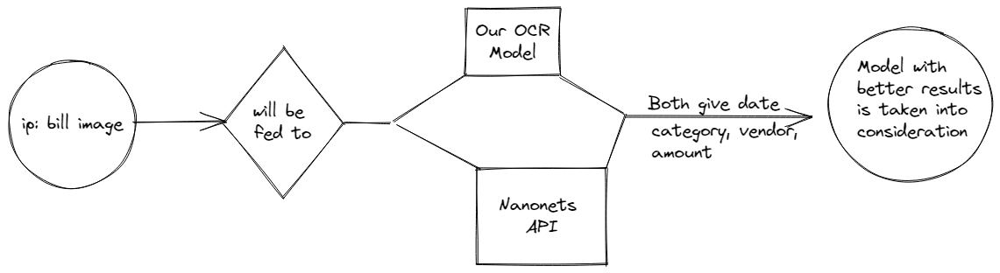

<br />

<p align="center">
    
</p>

<h2 align="center">Cashflow</h2>
<br />

<p align="justify">
    A Progressive web-application (PWA) that helps you track your expenses in an efficient manner using OCR and make you aware of your spending habits using various charts along with additional features of setting goals and reminders
</p>

## Features 

- Great UX by leveraging OCR and OpenCv for text detection and extraction
- Setting monthly goals for specific events like birthdays, etc
- Reminder for fixed expenses  like EMIs, Bills, etc
- Analysis of prev transactions through heatmaps, pie-chart, etc
- Showing user which category has the most expense via stacked bar chart
- Make user aware of its spending habits!
 

## Need a demo?

- Visit the hosted [version](https://flowcash.netlify.app/login)
- Login using demo users and passwords
- You can view the backend [here](https://github.com/varunmamtora06/cashflow-backend)
```
username: user_demo
password: Cash@1234

the demo version does not contain OCR functionality, 
for that please refer Local setup section below 

```

## Why our application will give accurate results?



- Our model utilizes PyTesseract to find the words such as amount/total/grand total/cash usually found on Indian bills/reciept and creating a bounding box around these using openCV
- Since there was low training data available on Indian bills coupled with time constraints, we had to rely on third party nanonets API for backup
- We are cross-examining both results and finding the better of the two

## Tech-stack

- React and it's related packages
- Django rest framework
- PyTessearct, OpenCV, RegEx

## Motivation?

- To build something that is relevant to current needs
    - [80% Indians Say Covid-19 A Wakeup Call To Fix Their Financial Health](https://www.outlookindia.com/website/story/business-news-80-indians-say-covid-19-a-wakeup-call-to-fix-their-financial-health-survey/399430)
    - The pandemic broke the age old mirage of job-security and made people swallow the hard pill that concepts like personal finance, budgetting, tracking expenditure are important
-  To build our first PWA

## API
- Nanonets
- GoogleMapsAPI

## Local setup
 
 **1. Clone [server repo](https://github.com/varunmamtora06/cashflow-backend) & follow the steps mention [here](https://github.com/varunmamtora06/cashflow-backend/blob/master/README.md) to run server locally:-**
 
 **2. Clone this repo by running the following command :-**
 ```
  git clone https://github.com/ShyrenMore/cashflow-frontend.git
  cd cashflow-frontend
 ```
 
 **3. Now install all the required packages by running the following commands :-**
 ```
  npm install 
 ```
 **4. Now start the react by running the following command :-**
 ```
  npm start
 ```
 **5. Create a `.env` file in the project root folder and copy the format of `.env.sample` file.**

   - `.env.sample` file contains all the environment variables required for running the project.
   
   
 **6.** **🎉  Open your browser and go to  `https://localhost:3000`**


## Authors

- **Chiraayu Meghnani**
    - [LinkedIn](http://www.linkedin.com/in/chiraayu-pravin) | [Gmail](mailto:chiraayupm@gmail.com) 
- **Parth Cheulkar**
    - [Linkedin](https://linkedin.com/in/parthcheulkar/) | [Gmail](pscheulkar12@gmail.com) | [Twitter](https://twitter.com/Parth_Vader__)
- **Shyren More**
    - [LinkedIn](https://www.linkedin.com/in/shyrenmore/) | [Gmail](mailto:shyren.more30@gmail.com) | [Angel.co](https://angel.co/u/shyren-more)
- **Varun Mamtora**
    - [LinkedIn](https://www.linkedin.com/in/varun-mamtora-0b725b171/) | [Gmail](mailto:varunmamtora@gmail.com) | [Twitter](https://twitter.com/MamtoraVarun) | [Angel.co](https://angel.co/u/varun-mamtora)
   
## References

[react-calendar-heatmap](https://github.com/kevinsqi/react-calendar-heatmap), [react-chartjs-2](https://react-chartjs-2.netlify.app/), [react-gradient-progress](https://github.com/prasannamestha/react-gradient-progress)
